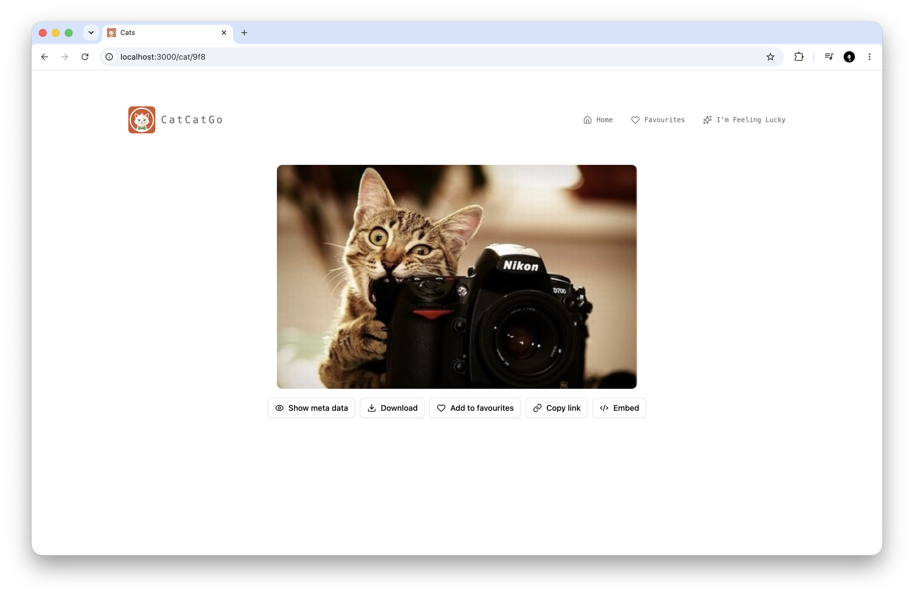

# Run the app

1. Install dependencies: `bun install`.
2. Add .env file and put your thecatapi.com api key.
3. Start a development server: `bun dev` or `bun start` for production.

This project was created using `bun init` in bun v1.3.14. [Bun](https://bun.com) is a fast all-in-one JavaScript runtime.

## Demo

## Info

This is a simple web application that fetches cat images from [The Cat API](https://thecatapi.com/) and displays them in a grid layout. 
It also has a detail page for a cat image that shows the image and its data.

## Technologies and tools

- Bun 
- React.js
- Tailwind CSS
- Shadcn UI
- Lucide Icons
- TypeScript
- React Router
- The Cat API

## Structure

- `src/api` - API client for The Cat API
- `src/components` - Shared UI components (`ui/` for shadcn primitives, `buttons-utils/` for action buttons)
- `src/hooks` - Data-fetching and state hooks
- `src/pages` - Route-level pages
- `src/lib` - API helpers, constants, and utilities
- `src/types` - Shared TypeScript types
- `build.ts` - Bun build script
